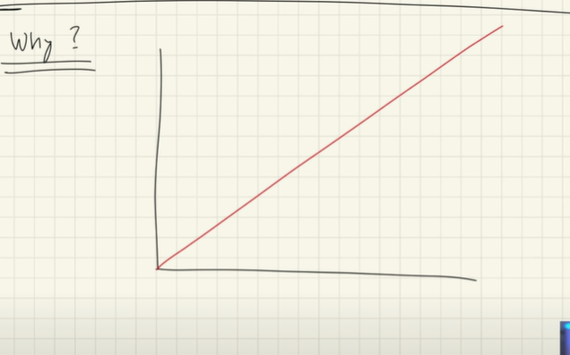
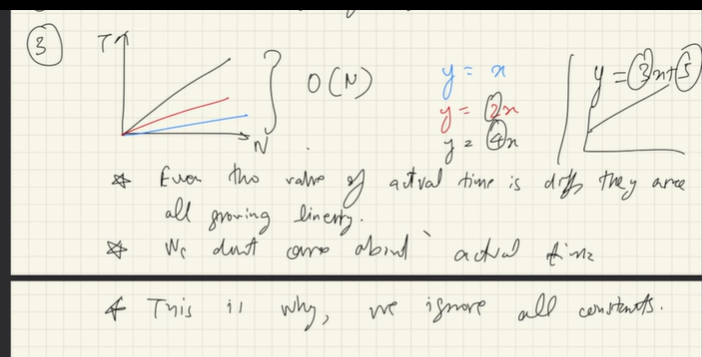
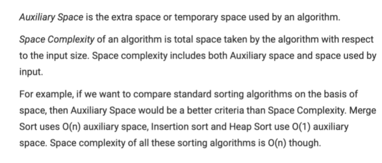
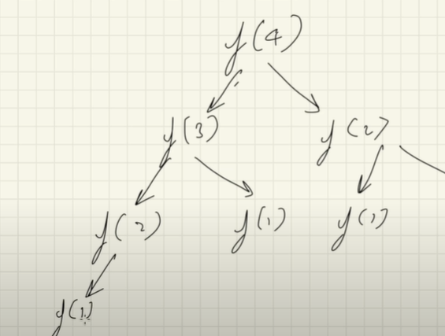

// what is time complexity ?
// same time complexity 
// time complexity !== time taken
// same pattern becaulse of the 
// time is grow as the input is grow : (Time complexity)
// if its linear ()

Linear Search
0(1) < O(logN) < O(n) < O(2 ^n)

What we consider when thinking about the time complexity:

Worst case time complexity 
1. Always look for the worst time complexity
2. Always Look of complexity for large pool of data
3. 
4. O(n ^3 + log N) Always ignore less dominite terms

Big ON Notation

word Defination O(n^3) : upper bound will not exceed this

Big Omega Notation 

opposite of big notation

basically it lower bond (Means it will take minimum time)

Little O notation

* this is also giving uper bound
Loose up

space complexity 

Auxilary space

Recursive Alogrithm (Space complexity) (Height of the recursion tree) (Path of the tree)

Only call that are interlinked will be in the stack at same time

O(n)

Divide and Conquer : requerence

